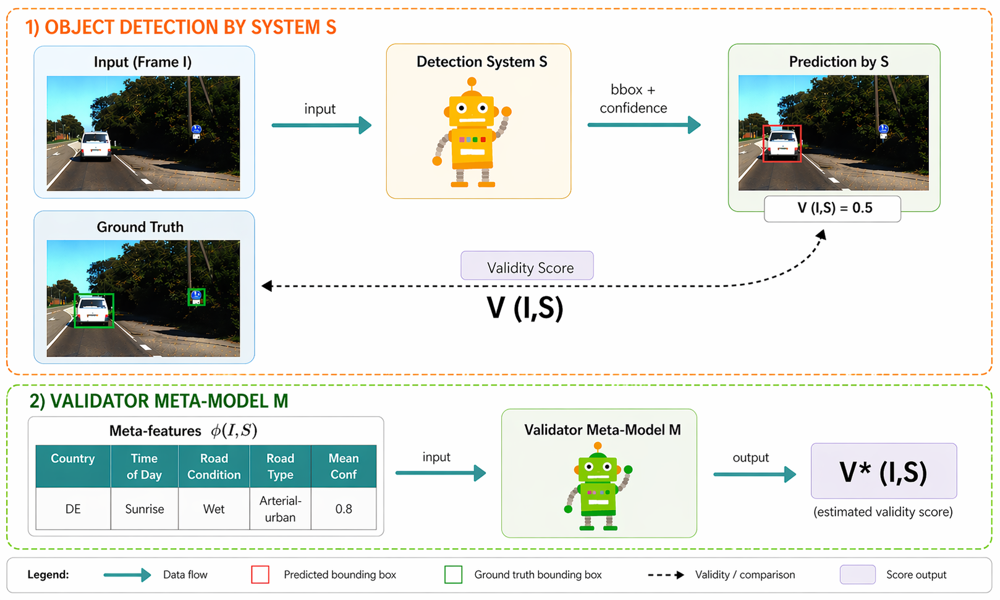
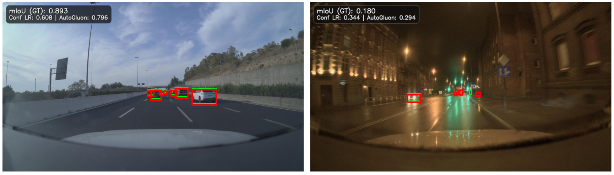
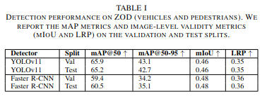
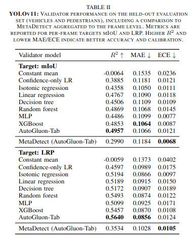
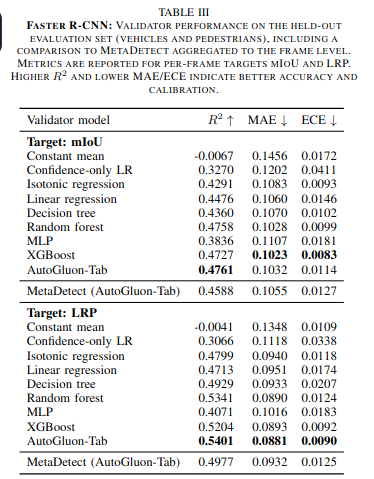

# Frame-Level Trust for Object Detection in Driving Scenes

This repository accompanies our accepted conference paper on predicting the reliability of object detectors in real driving scenes. The goal is to estimate, for a given image and detector, how trustworthy the detector output is before using it downstream.

We study lightweight validator models that take meta-features derived from the scene and the detector output, and predict a validity target such as mean IoU or LRP. The codebase includes dataset preparation, detector inference, meta-feature extraction, and assessor training and analysis.

## Overview

Given an input frame `I` and an object detector `S`, we first run the detector and compare its predictions against ground truth to define a validity target `V(I, S)`. We then train a validator meta-model `M` to predict that target from image-level context and detector-side signals.

<p align="center">
  
</p>

## Qualitative examples

The validator is meant to reflect detector quality across easy and difficult scenes. In the examples below, green boxes are ground truth, red boxes are detector predictions, `mIoU (GT)` is the target validity score, and `AutoGluon` is the validator prediction.

<p align="center">
  
</p>

## Main results

The paper evaluates both the base object detectors and the downstream validator models on held-out ZOD splits.

<p align="center">
  
  
  
</p>

Key takeaways from the reported results:

- Simple confidence-only baselines are useful, but validator models consistently improve calibration and regression accuracy.
- Tabular meta-models are competitive and often strong enough without requiring image-based assessor inputs.
- The best results in the paper are obtained with `AutoGluon-Tab` on top of detector- and scene-level meta-features.

## Repository contents

- `src/data/`: meta-feature extraction, dataset building, Hugging Face dataset upload helpers
- `src/models/`: detector training and inference, target metric computation, assessor-related utilities
- `src/utils/`: data conversion utilities such as ZOD to COCO and COCO to YOLO
- `notebooks/`: analysis notebooks and assessor experiments
- `assets/`: figures and tables used in the paper

## Setup

The project is managed with Poetry and targets Python `>=3.11, <3.14`.

```bash
poetry install
poetry shell
```

`detectron2` is installed separately in our setup:

```bash
pip install --extra-index-url https://miropsota.github.io/torch_packages_builder detectron2==0.6+fd27788pt2.9.1cu128
```

Some dependencies are CUDA-specific and pinned in `pyproject.toml`. If your environment differs, expect to adjust the `torch` and `torchvision` builds accordingly.

## Data and pretrained artifacts

Pretrained detectors:

- YOLO: `https://huggingface.co/femartip/yolo-zod`
- Faster R-CNN: `https://huggingface.co/femartip/faster-rcnn-zod`

Released tabular datasets:

- Meta-features only: `https://huggingface.co/datasets/femartip/zod-metafeatures`
- Faster R-CNN targets: `https://huggingface.co/datasets/femartip/zod-faster-rcnn-metafeatures`
- YOLO targets: `https://huggingface.co/datasets/femartip/zod-yolo-metafeatures`

Local data is expected under `data/`, with ZOD placed at `data/zod/`. The repository also supports derived COCO and YOLO layouts under `data/zod_coco/` and `data/zod_yolo/`.

## Minimal reproduction flow

### 1. Convert ZOD annotations

```bash
python src/utils/zod_to_coco.py
python src/utils/coco_to_yolo.py
```

### 2. Extract scene meta-features

```bash
python src/data/zod_to_tabular.py 1000
```

This produces `data/metafeatures.csv`.

### 3. Run detector inference and compute targets

```bash
python src/models/run_inference.py yolo <path-to-yolo-weights.pt> --test
python src/models/run_inference.py faster-rcnn <path-to-model-weights.pth> --test
```

Example outputs:

- `results/yolo/detections.json`
- `results/faster-rcnn/detections.json`

### 4. Build detector-specific training tables

```bash
python src/data/combine_data_predictions.py yolo metafeatures --level image
python src/data/combine_data_predictions.py faster-rcnn metafeatures --level image
```

Example outputs:

- `data/yolo_metafeatures.csv`
- `data/faster-rcnn_metafeatures.csv`

### 5. Train and analyze validator models

The current assessor workflow is notebook-driven:

- `notebooks/assessors.ipynb`
- `notebooks/assessors_classification.ipynb`
- `notebooks/assess_pred_analysis.ipynb`

## MetaDetect branch

The repository also includes a `metadetect` branch for experiments reproducing MetaDetect-style features from raw detector outputs.

That branch uses pre-NMS detector predictions to build feature tables comparable to MetaDetect and then evaluates them as an alternative assessor input space.

Typical usage on that branch:

```bash
python src/models/run_inference.py yolo <path-to-yolo-weights.pt> --test --save-raw
python src/models/run_inference.py faster-rcnn <path-to-model-weights.pth> --test --save-raw

python src/data/build_metadetect_dataset.py yolo --raw results/yolo/raw_predictions.jsonl --targets results/yolo/detections.json
python src/data/build_metadetect_dataset.py faster-rcnn --raw results/faster-rcnn/raw_predictions.jsonl --targets results/faster-rcnn/detections.json
```

Example outputs:

- `data/yolo_metadetect.csv`
- `data/faster-rcnn_metadetect.csv`

## Lessons learned

- Adding the image as input does not help.
- Using an MLLM to extract features also does not help.
- Fine-tuning a relatively small MLLM to directly predict the validity indicator from the image also does not help.

## Notes

- The released paper figures in `assets/` are included here for convenience and for linking this repository in the camera-ready paper.
- Citation metadata can be added once the final bibliographic information is public.
